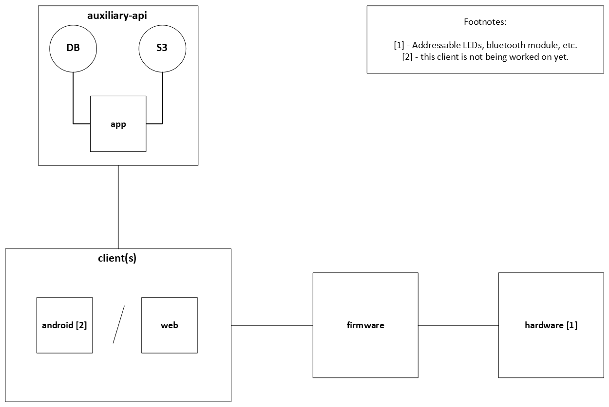

# Architecture

Please take a look at our project's architecture. The apps that you'll find below ([auxiliary-api](https://github.com/Szpontniki/auxiliary-api), [web](https://github.com/Szpontniki/web), and [firmware](https://github.com/Szpontniki/firmware)), are all open source and you're free inspect theirs code. We're using [PostgreSQL](https://github.com/postgres/postgres) as our database and [RustFS](https://github.com/rustfs/rustfs) as the S3 service.

